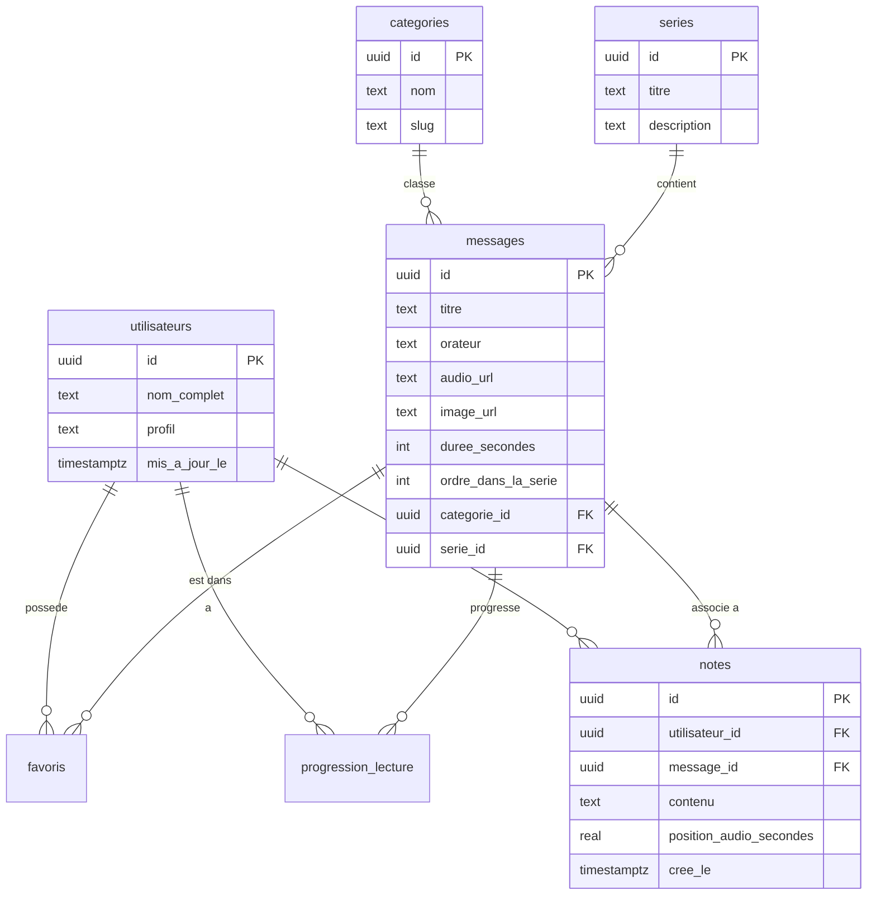

# Architecture de Charis Nation (charis_web)

Ce document présente l'architecture globale, le schéma de base de données, la structure des dossiers et une description détaillée des fichiers du projet **Charis Nation** (`charis_web`).

---

## 🗺️ 1. Vue d'ensemble de l'Architecture

Le projet est une application web moderne de type SPA (Single Page Application) construite avec **Next.js** (App Router) et **React 19**, intégrée à la plateforme Backend-as-a-Service **Supabase**.

L'application est divisée en deux grands espaces :
1. **L'espace Public (Utilisateur)** : Un lecteur audio d'enseignements/prédications immersif et soigné (style premium, HSL dynamique, mode sombre/clair persistant sans flash, prise de notes synchronisée avec l'audio, favoris et suivi de progression de lecture).
2. **L'espace Administration (Dashboard)** : Un panel d'administration isolé esthétiquement permettant la gestion (CRUD) des utilisateurs, messages, catégories et séries d'enseignements.

### Stack Technique

* **Framework** : [Next.js](https://nextjs.org/) (v16.2+) avec le routeur de dossiers (`app/`)
* **Logiciel Client / Serveur** : [React](https://react.dev/) (v19)
* **Base de données & Auth** : [Supabase](https://supabase.com/) (PostgreSQL + RLS + Storage)
* **Stylisation** : 
  * Espace public : CSS Vanilla moderne avec variables HSL, animations, et Glassmorphism (`globals.css`).
  * Espace admin : [Tailwind CSS](https://tailwindcss.com/) (v4.0) via un import dédié (`dashboard.css`).
* **Icônes** : [Lucide React](https://lucide.dev/)


---

## 🎯 2. Fonctionnalités Attendues & Implémentées

Le projet répond à un ensemble de besoins précis pour offrir une expérience utilisateur premium d'écoute spirituelle et une gestion de contenu simplifiée.

### 🎧 Espace Utilisateur (Public)

1. **Lecteur Audio Avancé & Flottant** :
   * Lecteur persistant en bas de l'écran qui ne s'interrompt pas pendant la navigation.
   * Commandes riches : lecture/pause, avancement et recul rapide (15 secondes), vitesse de lecture ajustable (1x, 1.25x, 1.5x, 1.75x, 2x).
   * Partage intelligent : Génération de liens de partage qui pointent vers un instant précis de la prédication via un paramètre d'URL (ex: `?t=120` pour démarrer à la 2e minute).

2. **Reprise de l'Écoute (Auto-resume)** :
   * Sauvegarde continue de la position d'écoute.
   * Reprise automatique à l'endroit exact de l'arrêt précédent avec un décalage de courtoisie de 3 secondes pour se remettre dans le contexte de l'écoute.
   * Marquage automatique d'un enseignement comme "Terminé" dès qu'il a été écouté à hauteur de 95% ou plus.

3. **Prise de Notes Synchronisées** :
   * Saisie de notes personnelles pendant l'écoute d'un enseignement.
   * Chaque note capture automatiquement l'horodatage exact de l'audio.
   * Possibilité de cliquer sur une note pour déplacer instantanément la tête de lecture à cet instant précis (idéal pour réécouter une explication liée à une note).

4. **Favoris & Suivi** :
   * Ajout d'enseignements aux favoris via un bouton cœur interactif.
   * Section "Série en cours" sur l'accueil pour reprendre instantanément les écoutes entamées.
   * Onglets dédiés pour regrouper tous ses favoris et toutes ses notes de prédications.

5. **Exploration & Recherche** :
   * Filtrage interactif par catégories (Foi & Croyance, Prière, Vie chrétienne, Prophétie, Louange & Adoration, Famille) avec emojis spécifiques.
   * Regroupement thématique en **Séries d'enseignements** pour suivre les parcours théologiques dans l'ordre préconisé.
   * Barre de recherche globale temps réel (recherche sur le titre ou l'orateur).

6. **Authentification & Robustesse Hors-ligne** :
   * Connexion et inscription sécurisées (authentification Supabase).
   * Synchronisation distante fluide et transparente (toutes les 30s de lecture, à la mise en pause, ou au changement de visibilité de l'onglet).
   * Système hybride : Fonctionnement parfait en local (via `localStorage`) pour les utilisateurs anonymes ou en cas d'indisponibilité réseau, synchronisé dès que possible.

7. **Abonnement Visuel Premium (UX/UI)** :
   * Thème sombre / clair dynamique et persistant, sans scintillement ou flash blanc au chargement des pages.
   * Graphismes soignés (glassmorphism, ombres douces, palettes de couleurs HSL harmonisées, micro-animations au survol).
   * Indicateurs visuels de chargement (skeletons animés).

### 🛠️ Espace Administration (Dashboard)

1. **Contrôle d'Accès Sécurisé** :
   * Accès restreint uniquement aux comptes utilisateurs ayant le profil `'admin'` (vérifié côté serveur et par des politiques PostgreSQL RLS).

2. **Vue d'ensemble Metrics** :
   * KPI en temps réel sur le volume de données (total messages, catégories, séries, utilisateurs).

3. **Gestion du Catalogue de Contenus (CRUD complet)** :
   * **Messages** : Ajout, édition et suppression de prédications, avec téléversement (upload) des fichiers audio et des jaquettes directement dans le stockage cloud (Supabase Buckets).
   * **Catégories** : CRUD des catégories avec génération automatique de slugs propres pour le référencement (SEO).
   * **Séries** : CRUD des séries thématiques pour structurer les contenus.

4. **Gestion des Utilisateurs** :
   * Liste des membres inscrits et possibilité d'élever des profils au rang d'administrateur.

---

## 📁 3. Structure des Dossiers

Voici l'organisation générale du code source du projet :

```text
charis_web/
├── public/                 # Fichiers statiques publics (images, icônes, favicon)
├── supabase/               # Fichiers de configuration et migrations Supabase
│   └── migrations/         # Scripts SQL de migration de base de données
└── src/
    ├── app/                # Pages, layouts, et routage Next.js (App Router)
    │   ├── auth/           # Pages d'authentification (Connexion/Inscription)
    │   ├── dashboard/      # Panel d'administration
    │   ├── explorer/       # Page d'exploration des messages et catégories
    │   └── message/        # Détail d'un enseignement [id] (lecteur & notes)
    ├── assets/             # Assets statiques importables dans le code (PNG/SVG)
    ├── components/         # Composants React réutilisables (AudioPlayer, TrackCard...)
    ├── contexts/           # Contextes React globaux (Auth, Audio, Theme)
    └── lib/                # Fonctions utilitaires, clients API et services
        ├── services/       # Services métier interagissant avec Supabase (messages, user)
        └── supabase/       # Configuration client/serveur pour Supabase SSR
```

---

## 📄 4. Description Fichier par Fichier

### 🌐 4.1. Fichiers de configuration à la racine

* **`package.json`** : Contient les métadonnées du projet, les scripts de démarrage (`dev`, `build`, `start`, `lint`) et les dépendances (Next, React, Tailwind v4, Supabase JS, Lucide-React).
* **`middleware.js`** : Intercepteur HTTP global de Next.js. Il appelle `updateSession` pour rafraîchir le cookie de session Supabase à chaque navigation (crucial pour le rendu côté serveur - SSR).
* **`jsconfig.json`** : Configure les alias de chemins (ex: `@/*` pointant sur `src/*`) pour simplifier les imports dans le projet.
* **`postcss.config.mjs`** & **`eslint.config.js`** : Configurations respectives du compilateur CSS PostCSS (avec Tailwind) et du linter ESLint.

---

### 🗄️ 4.2. Base de données & Migrations (`supabase/migrations/`)

Les scripts SQL décrivent la structure et la politique de sécurité de la base de données PostgreSQL de Supabase.

* **[001_initial_schema.sql](file:///home/fabien/Documents/Projets/Pro/charis_web/supabase/migrations/001_initial_schema.sql)** : 
  * Création des tables principales (`utilisateurs`, `categories`, `series`, `messages`, `favoris`, `progression_lecture`, `notes`).
  * Définition du trigger `on_auth_user_created` sur la table `auth.users` pour copier automatiquement le profil dans `public.utilisateurs` lors de l'inscription.
  * Activation de la sécurité au niveau des lignes (**Row Level Security - RLS**) sur toutes les tables.
* **[002_admin_rls.sql](file:///home/fabien/Documents/Projets/Pro/charis_web/supabase/migrations/002_admin_rls.sql)** : Ajout des politiques de sécurité pour permettre aux administrateurs de gérer les données.
* **[003_storage_setup.sql](file:///home/fabien/Documents/Projets/Pro/charis_web/supabase/migrations/003_storage_setup.sql)** :
  * Création des buckets de stockage publics : `messages_audio` (fichiers audio des prédications) et `messages_images` (jaquettes des messages).
  * Politiques de stockage limitant l'upload aux utilisateurs ayant le profil `'admin'`.
* **[004_fix_rls_recursion.sql](file:///home/fabien/Documents/Projets/Pro/charis_web/supabase/migrations/004_fix_rls_recursion.sql)** :
  * Résolution d'un bug de récursion infinie dans les RLS.
  * Introduction de la fonction `security definer` appelée `get_user_profil(user_id)` pour lire le profil d'un utilisateur sans déclencher de boucle infinie sur la table `utilisateurs`.
* **[005_fix_messages_policies.sql](file:///home/fabien/Documents/Projets/Pro/charis_web/supabase/migrations/005_fix_messages_policies.sql)** : Uniformisation des politiques RLS de la table `messages` en utilisant `get_user_profil`.
* **[006_add_image_url_column.sql](file:///home/fabien/Documents/Projets/Pro/charis_web/supabase/migrations/006_add_image_url_column.sql)** : Ajoute de manière sécurisée la colonne `image_url` à la table `messages` pour stocker le lien de l'image de couverture.

---

### 💻 4.3. Logique Applicative & Supabase Client (`src/lib/`)

#### Configuration Supabase SSR (`src/lib/supabase/`)
* **[client.js](file:///home/fabien/Documents/Projets/Pro/charis_web/src/lib/supabase/client.js)** : Singleton configuré pour créer le client Supabase côté navigateur (`createBrowserClient`), utilisé dans les composants client et contextes React.
* **[server.js](file:///home/fabien/Documents/Projets/Pro/charis_web/src/lib/supabase/server.js)** : Fonction asynchrone créant le client Supabase côté serveur (`createServerClient`) avec gestion des cookies. Nécessaire pour les Server Components et Server Actions.
* **[middleware.js](file:///home/fabien/Documents/Projets/Pro/charis_web/src/lib/supabase/middleware.js)** : Met à jour la session utilisateur en lisant/écrivant les cookies depuis l'intercepteur de requêtes HTTP Next.js.

#### Services d'API métier (`src/lib/services/`)
Ces services encapsulent les appels à la base de données Supabase.
* **[messages.js](file:///home/fabien/Documents/Projets/Pro/charis_web/src/lib/services/messages.js)** :
  * `getMessages(...)` : Récupère la liste des prédications avec filtres de recherche textuelle, de catégorie ou de série, ordonnés par date de publication.
  * `getMessageById(id)` : Charge les détails d'une prédication spécifique (catégorie et série incluses).
  * `getMessagesBySerie(serieId)` : Récupère tous les messages d'une série donnée dans l'ordre d'écoute.
  * `getCategories()` & `getSeries()` : Récupèrent les listes de catégories et de séries existantes.
* **[user.js](file:///home/fabien/Documents/Projets/Pro/charis_web/src/lib/services/user.js)** :
  * `getUserProgress(userId)` / `upsertProgress(...)` : Récupère et sauvegarde la progression d'écoute d'un message audio (seconde courante, statut terminé si progression >= 95%).
  * `getUserFavorites(userId)` / `toggleFavorite(...)` : Gère l'ajout ou la suppression d'un message dans les favoris de l'utilisateur.
  * `getUserNotes(userId)` / `addUserNote(...)` / `deleteUserNote(...)` : Gère les notes textuelles personnelles qu'un membre saisit à un horodatage (timestamp) précis de l'audio.

---

### 🧠 4.4. Gestion d'État Globale (`src/contexts/`)

Les contextes permettent de partager l'état et les comportements à travers toute l'application.

* **[ThemeContext.jsx](file:///home/fabien/Documents/Projets/Pro/charis_web/src/contexts/ThemeContext.jsx)** :
  * Gère le thème visuel (`light` ou `dark`).
  * Persiste le choix de l'utilisateur dans le `localStorage`.
  * Injecte ou retire la classe `.dark` sur la balise `<html>`.
* **[AuthContext.jsx](file:///home/fabien/Documents/Projets/Pro/charis_web/src/contexts/AuthContext.jsx)** :
  * Gère le cycle de vie de la session Supabase (`user`, `session`, `profile`, état de chargement `loading`).
  * Propose des fonctions d'inscription (`signUp`), connexion (`signIn`, `signInWithOAuth`) et de déconnexion (`signOut`).
  * Expose des helpers d'autorisation comme `isAuthenticated` et `isAdmin` (vérifiant si le profil dans la base est `'admin'`).
* **[AudioContext.jsx](file:///home/fabien/Documents/Projets/Pro/charis_web/src/contexts/AudioContext.jsx)** :
  * **Cœur fonctionnel de l'application**. Gère l'élément HTML5 `Audio` global (`audioRef`).
  * Contrôle la piste en cours (`currentTrack`), la vitesse de lecture (`playbackSpeed`), le temps courant (`currentTime`), le statut de lecture (`isPlaying`).
  * Gère les fonctionnalités d'écoute : lecture/pause, avancement/recul de 15s (`skip`), modification de la vitesse de lecture (`1x`, `1.25x`, `1.5x`, `1.75x`, `2x`), déplacement précis dans l'audio (`seek`).
  * Synchronise localement la progression d'écoute dans le `localStorage` et déclenche une sauvegarde distante dans Supabase (`upsertProgress`) toutes les 30 secondes de lecture, lors de la mise en pause, ou lorsque l'onglet est masqué (`visibilitychange`).
  * Gère le panneau latéral de prise de notes (`isNotesPanelOpen`, `addNote`, `deleteNote`).

---

### 🎨 4.5. Composants UI (`src/components/`)

* **[ClientAppWrapper.jsx](file:///home/fabien/Documents/Projets/Pro/charis_web/src/components/ClientAppWrapper.jsx)** : 
  * Enveloppe applicative cliente qui initialise les fournisseurs de contextes (`ThemeProvider` -> `AuthProvider` -> `AudioProvider`).
  * Contient le pont de synchronisation `AudioSyncBridge` pour passer l'ID de l'utilisateur connecté au service audio.
  * Structure le layout principal en intégrant de façon persistante le lecteur audio du bas (`AudioPlayer`) et le volet de notes (`NotesPanel`).
* **[AudioPlayer.jsx](file:///home/fabien/Documents/Projets/Pro/charis_web/src/components/AudioPlayer.jsx)** : Lecteur audio flottant fixe (ancré en bas de page) affichant le titre en cours, la barre de progression interactive, le contrôle du volume, le réglage de la vitesse de lecture, et les raccourcis pour ouvrir les notes et le menu de partage.
* **[NotesPanel.jsx](file:///home/fabien/Documents/Projets/Pro/charis_web/src/components/NotesPanel.jsx)** : Tiroir coulissant latéral droit (sur ordinateur) permettant à l'utilisateur de saisir des notes de prédication en temps réel. Chaque note est automatiquement associée à la seconde de lecture en cours. Cliquer sur une note existante repositionne l'audio à ce moment exact.
* **[NavigationDrawer.jsx](file:///home/fabien/Documents/Projets/Pro/charis_web/src/components/NavigationDrawer.jsx)** : Menu latéral gauche coulissant contenant les liens de navigation (Accueil, Favoris, Notes, Dashboard d'administration si admin), les informations du profil utilisateur connecté, et le bouton de connexion/déconnexion.
* **[Header.jsx](file:///home/fabien/Documents/Projets/Pro/charis_web/src/components/Header.jsx)** : Barre supérieure contenant le logo de l'église, le champ de recherche globale en temps réel, le sélecteur de thème sombre/clair, et le déclencheur du menu hamburger.
* **[TrackCard.jsx](file:///home/fabien/Documents/Projets/Pro/charis_web/src/components/TrackCard.jsx)** : Carte interactive représentant un enseignement audio. Propose deux styles d'affichage (grille ou liste). Affiche le titre, l'orateur, l'image de couverture, la durée, le bouton d'écoute rapide et le statut d'ajout en favoris.
* **[Announcements.jsx](file:///home/fabien/Documents/Projets/Pro/charis_web/src/components/Announcements.jsx)** : Section de bannières esthétiques ("Série à la une", "Versets du jour") sous forme de carrousel ou de grille responsive.
* **[SkeletonLoader.jsx](file:///home/fabien/Documents/Projets/Pro/charis_web/src/components/SkeletonLoader.jsx)** : Composant de chargement avec animation de pulsation (Shimmer/Pulse) pour offrir une excellente expérience visuelle (perceived performance) pendant le chargement initial des données.
* **[ShareMenu.jsx](file:///home/fabien/Documents/Projets/Pro/charis_web/src/components/ShareMenu.jsx)** : Popover facilitant le partage d'une prédication ou d'un instant précis (génère un lien avec paramètre `?t=seconds`).

---

### 🛣️ 4.6. Routage de l'Espace Public (`src/app/`)

Chaque sous-dossier de `src/app/` contenant un fichier `page.jsx` représente une route URL accessible.

* **[layout.jsx](file:///home/fabien/Documents/Projets/Pro/charis_web/src/app/layout.jsx)** : Layout racine de l'application.
  * Charge les polices d'écriture Google Fonts (*Plus Jakarta Sans* pour les textes et *Italianno* pour les titres artistiques).
  * Contient un script inline injecté dans `<head>` pour appliquer immédiatement le thème sombre ou clair enregistré dans le `localStorage` afin d'éviter tout flash blanc désagréable à l'affichage (FOUC).
  * Définit les métadonnées SEO et OpenGraph du projet.
* **[globals.css](file:///home/fabien/Documents/Projets/Pro/charis_web/src/app/globals.css)** : Feuille de style CSS principale. Extrêmement riche (plus de 2500 lignes), elle gère l'entièreté de la charte graphique de la partie utilisateur (layouts, animations, tiroirs coulissants, mode sombre, glassmorphism, responsive mobile, boutons, sliders et formulaires).
* **[page.jsx](file:///home/fabien/Documents/Projets/Pro/charis_web/src/app/page.jsx)** : Page d'accueil de la plateforme.
  * Intègre la recherche en temps réel.
  * Affiche des sections dynamiques : "Série en cours" (pour reprendre l'écoute à la seconde près d'un enseignement entamé), "Derniers messages" et "Favoris".
  * Comporte un encart d'incitation (Call-To-Action) pour s'inscrire si l'utilisateur est anonyme.
  * Permet de naviguer entre l'onglet Accueil, l'onglet global des Notes et l'onglet Favoris.
* **`auth/login/page.jsx`** & **`auth/signup/page.jsx`** : Pages d'authentification esthétiques (formulaires de connexion par mot de passe et d'inscription avec création de compte).
* **`explorer/page.jsx`** : Page de recherche avancée permettant de filtrer les enseignements en cliquant sur des badges de catégories (Foi, Prière, Famille...) ou de naviguer par séries de prédications.
* **`message/[id]/page.jsx`** : Page de focus et de lecture détaillée d'une prédication.
  * Permet de lire et d'écouter le message avec une jaquette géante et un bouton de lecture central.
  * Propose une navigation simplifiée au sein d'une série d'épisodes (précédent/suivant).
  * Intègre un onglet de détails de la série et un onglet dédié à la saisie de notes synchronisées avec l'audio.
  * Supporte le démarrage automatique à un temps précis via le paramètre URL `?t=X`.

---

### 🛡️ 4.7. Routage du Panel d'Administration (`src/app/dashboard/`)

Cet espace permet aux utilisateurs disposant du profil `admin` de gérer le catalogue.

* **[layout.jsx](file:///home/fabien/Documents/Projets/Pro/charis_web/src/app/dashboard/layout.jsx)** : Met en page l'administration avec une barre latérale (Sidebar) flottante et ergonomique contenant les liens vers les différents modules CRUD. Il isole le design du dashboard.
* **[dashboard.css](file:///home/fabien/Documents/Projets/Pro/charis_web/src/app/dashboard/dashboard.css)** : Importe Tailwind CSS v4 et définit le thème de couleurs spécifique à la console d'administration.
* **[page.jsx](file:///home/fabien/Documents/Projets/Pro/charis_web/src/app/dashboard/page.jsx)** : Vue d'ensemble affichant des cartes de statistiques de la base de données (nombre total de messages, catégories, séries et utilisateurs enregistrés).
* **`titres/page.jsx`** : Gestion des prédications audio (création d'un nouveau titre avec upload audio/image, modification des informations orateur/durée/catégorie/série et suppression).
* **`categories/page.jsx`** : CRUD des catégories d'enseignements avec génération automatique de slugs URL (ex: "Vie chrétienne" -> `vie-chretienne`).
* **`series/page.jsx`** : CRUD de séries (regroupement ordonné de prédications).
* **`utilisateurs/page.jsx`** : Liste des utilisateurs enregistrés et gestion de leur rôle (promouvoir membre vers admin).

---

## 🔒 5. Modèle de Données & Flux de Synchronisation

Voici le schéma relationnel simplifié géré par le projet :



### 🔄 Flux d'écoute et de synchronisation

1. **Chargement de la piste** : Lorsque l'utilisateur clique sur "Play" sur une carte, l'audio est initialisé. Si une progression existait dans le `localStorage` ou la base de données (récupérée par `getUserProgress`), le lecteur propose de reprendre là où l'utilisateur s'était arrêté (avec un retour confortable de 3 secondes en arrière).
2. **Prise de note** : L'utilisateur saisit une note dans le `NotesPanel` ou le tiroir du message. La position actuelle de l'audio (`currentTime`) est relevée. La note est stockée localement puis envoyée asynchronement via le service `addUserNote` à Supabase.
3. **Persistance asynchrone** : Durant la lecture, l'application effectue des sauvegardes régulières :
   * En local dans le `localStorage` instantanément à chaque mise à jour du temps.
   * Vers la base de données Supabase (`progression_lecture`) toutes les 30 secondes de lecture continue.
   * Immédiatement lors de la mise en pause.
   * Immédiatement si l'utilisateur quitte ou ferme l'onglet (événement `visibilitychange`).
